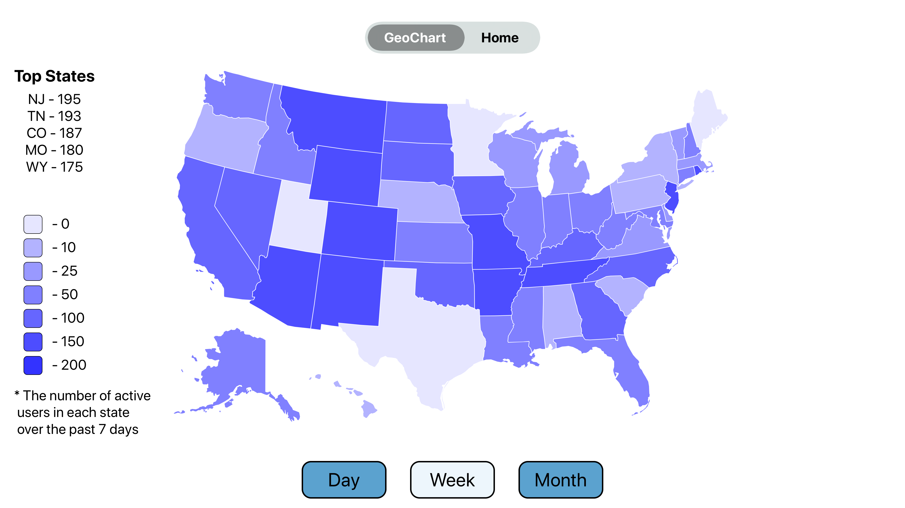

## Building the app

Due to many librarys not currently supporting tvOS out of the box we occasionally need to edit podfiles of these libraries

In order to build you will need to manually edit the `lottie-react-native.podspec` file. Change the s.platforms line to `s.platforms = { :ios => "8.0", :tvos => "9.2" }`

Currentlly only able to build from Xcode 11.2 CLI tools from command line

## TODO

The "Home" tab is left in place for a more general dashboard section

Started working on a "last updated" section that is currently in some of the mock ups
Would also love to make use of the fantastic Lottie library

